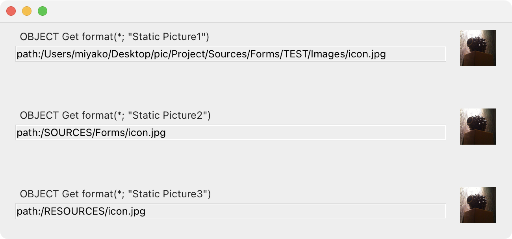
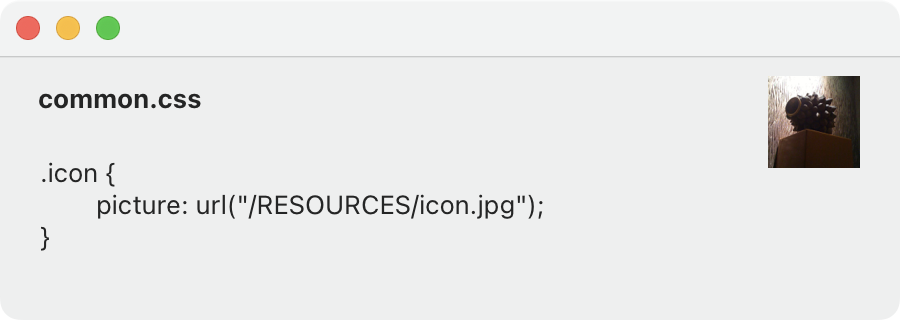

# 4d-tips-static-picture

スタティックピクチャの画像ファイルパスは**フォーマット**で設定します。

変数を表示する場合，フォーマットは`var:{変数名}`と記述します。

画像ファイルを表示する場合，フォーマットは`path:{パス名}`と記述します。`path:`は省略しても構いません。

ボタンのフォーマット（`file:{パス名}`または`#{パス名}`）とはシンタックスが違っている点に留意してください。

## 画像ファイルの場所

* `/SOURCES/`…ソースフォルダー内の相対パス。コンパイルしたプロジェクトの場合，`.4DZ`圧縮ファイル内の相対パス。
* `/RESOURCES/`…リソースフォルダー内の相対パス。プロジェクト共通の画像に向いています。
* その他…フォームフォルダー内の相対パス。フォーム特有の画像に向いています。

## CSSでパスを指定する場合

* プロパティ名: `picture`
* プロパティ値: `url({パス名})`

* 

# 資料

* コア開発 > ランゲージ > コンセプト > [パス名](https://developer.4d.com/docs/ja/Concepts/paths/)
* デスクトップアプリ > フォーム > フォームオブジェクトプロパティ > [ピクチャー](https://developer.4d.com/docs/ja/FormObjects/propertiesPicture/)
* [OBJECT SET FORMAT](https://doc.4d.com/4Dv20R4/4D/20-R4/OBJECT-SET-FORMAT.301-6656560.ja.html)
* デスクトップアプリ > フォーム > スタイルシート#特殊な属性値](https://developer.4d.com/docs/ja/FormEditor/stylesheets/#特殊な属性値)
